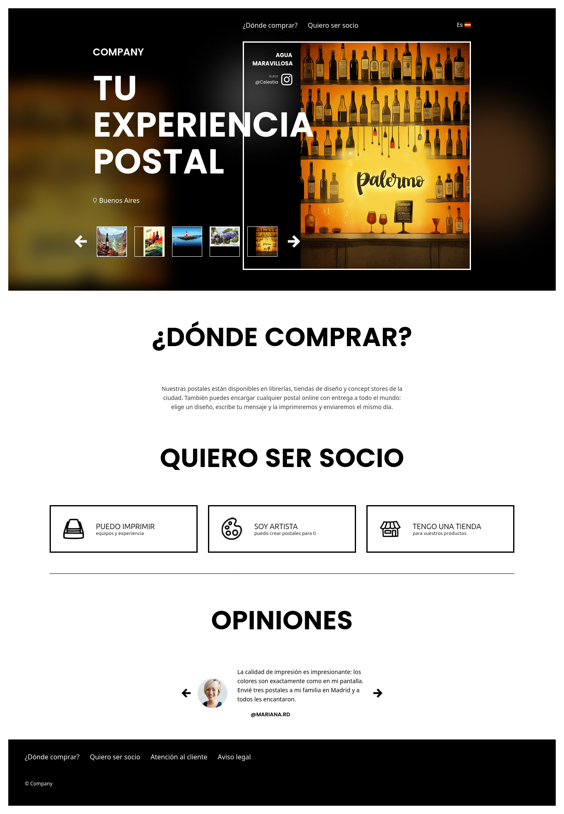

# Landing page

A responsive landing page for a postcard marketplace, built with React 19, TypeScript, and Vite 8.

**Live:** https://postcard-marketplace.onrender.com/



## Overview

Showcases 8 postcard designs with a drag-to-scroll desktop carousel and a swipe-based mobile carousel. Clicking a postcard opens a full-screen preview overlay with navigation, artist credits, and a description.

## Tech Stack

- **React 19** — UI framework
- **Vite 8** — Build tool with `@vitejs/plugin-react`
- **TypeScript 5** — Strict mode (`tsconfig.json`)
- **Plain CSS** — Per-component stylesheets, no CSS-in-JS or modules
- **oxlint** — Rust-based linter with TypeScript/React plugins (`.oxlintrc.json`)

## Scripts

| Command              | Description                        |
| -------------------- | ---------------------------------- |
| `npm run dev`        | Start dev server                   |
| `npm run build`      | Build for production               |
| `npm run preview`    | Preview production build           |
| `npm run lint`       | Run oxlint                         |
| `npm run typecheck`  | Type-check with `tsc --noEmit`     |
| `npm run check`      | Typecheck + lint in one pass       |

## Project Structure

```
src/
├── App.tsx                      # Root component, keyboard navigation, layout
├── main.tsx                     # Entry point
├── data.ts                      # 8 postcards with name, author, network, url, orientation, info
├── types.ts                     # Shared types (Postcard, Network, Orientation)
├── utils.ts                     # sleep() helper and network icon map
├── index.css                    # Global styles, fonts, responsive breakpoints
└── components/
    ├── Header.tsx / .css        # DesktopHeader + MobileHeader (responsive via CSS)
    ├── Carousel.tsx / .css      # Desktop thumbnail carousel (drag + arrow buttons)
    ├── MobileCarousel.tsx / .css# Mobile swipe carousel (touch gestures)
    ├── Preview.tsx / .css       # Full-screen postcard preview overlay
    └── Footer.tsx / .css        # Footer with links and copyright
```

## Features

- **Desktop carousel** — horizontal strip of thumbnails, mouse-drag scrolling, infinite-loop illusion via triplicated items, keyboard arrows (← →)
- **Mobile carousel** — 5-slot swipeable carousel with a larger active card, touch gesture navigation
- **Preview modal** — full-screen overlay with postcard image, artist info, left/right navigation, fade transitions
- **Responsive** — mobile layout at ≤800px with separate header + carousel components
- **Smooth animations** — CSS transitions for image crossfades, `requestAnimationFrame` + `easeOutCubic` for programmatic scroll/swipe

## License

MIT
